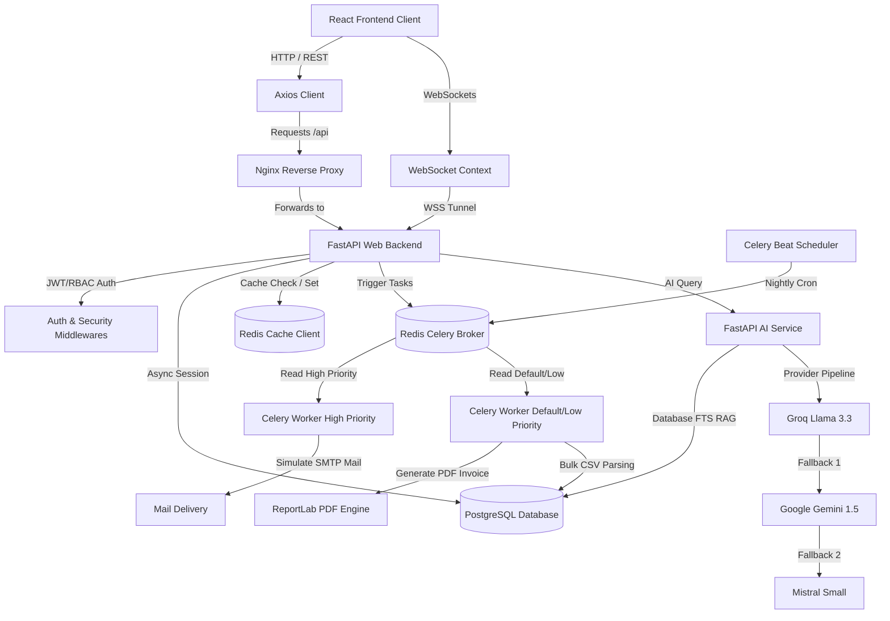

# ShopHub: Full-Stack E-Commerce System Documentation

Welcome to the **ShopHub** technical documentation. This document provides a comprehensive, deep-dive architectural guide detailing the full-stack systems, libraries, configurations, and core implementations utilized across the entire project.

---

## 1. System Architecture

Below is the high-level architecture showing how the React Client, API Gateways, FastAPI Backend, PostgreSQL DB, Redis caching/brokers, and Celery background workers interact:



---

## 2. Technology Stack

| Scope | Technology / Library | Version | Description |
| :--- | :--- | :--- | :--- |
| **Frontend** | React | `^19.2.6` | Component-based UI rendering framework |
| | TypeScript | `^6.0.3` | Type-safety, interfaces, and compile-time validation |
| | Tailwind CSS | `^4.3.1` | Modern styling and responsive flex grids |
| | React Router DOM | `^7.18.0` | SPA client-side routing, query parameters, and redirects |
| | Zustand | `^5.0.14` | Global client store (cart, toast, user states) |
| | React Query | `^5.101.1` | Async server state sync, mutation triggers, caching, refetch |
| | Axios | `^1.18.0` | HTTP client with automatic headers & interceptors |
| | React Hook Form | `^7.80.0` | Schema-driven form validation and inputs |
| | Zod | `^4.4.3` | Client-side validation schemas (login, checkout, search) |
| **Backend** | FastAPI | `0.138.0` | Asynchronous web framework for high-concurrency routing |
| | Uvicorn | `0.49.0` | High-performance ASGI server |
| | SQLAlchemy | `2.0.51` | Object-Relational Mapper (ORM) with async sessions |
| | asyncpg | `0.31.0` | Asynchronous native PostgreSQL database client |
| | Pydantic | `2.13.4` | Data modeling, validation, and JSON serialization |
| | Redis | `8.0.0` | Memory cache, WebSocket history container, and Celery broker |
| | Celery | `5.4.0` | Asynchronous distributed task queue worker |
| | ReportLab | `4.2.0` | Dynamic PDF generation engine |
| | SlowAPI | `0.1.10` | IP-based request rate limiter |
| | Groq / SDK | `1.5.0` | Streaming AI assistant and content generation |

---

## 3. Backend Core Architecture

The backend code is located under the [Backend](file:///d:/knowledge_factory_internship/E-commerce/Backend) directory and operates on FastAPI's asynchronous event loops.

### A. Authentication & Role-Based Access Control (RBAC)
* **JWT Handshake**: Implemented in [oauth2.py](file:///d:/knowledge_factory_internship/E-commerce/Backend/app/auth/oauth2.py). Users authenticate via `/auth/login` to obtain a JSON Web Token containing their user identity and role.
* **Dual Request Token Retrieval**: The authentication system retrieves tokens from:
  1. The HTTP `Authorization` header (`Bearer <token>`).
  2. Fallback `access_token` cookies (supporting WebSocket page handshakes).
* **RBAC Enforcement**: The dependency [get_current_admin_user](file:///d:/knowledge_factory_internship/E-commerce/Backend/app/auth/oauth2.py#L74-L83) intercepts admin endpoints (like `/products/import` or `/orders/all`) and ensures `current_user.role == "admin"`. If not, it raises a `403 Forbidden` error.

### B. Database Schema & SQL Optimizations
Database models are defined using SQLAlchemy declarative bases in [models](file:///d:/knowledge_factory_internship/E-commerce/Backend/app/models):
* [user.py](file:///d:/knowledge_factory_internship/E-commerce/Backend/app/models/user.py): Stores credentials, roles (`user`, `admin`), active states, and email verification tokens.
* [category.py](file:///d:/knowledge_factory_internship/E-commerce/Backend/app/models/category.py): Stores category headers (e.g. `Electronics`, `Fashion`).
* [product.py](file:///d:/knowledge_factory_internship/E-commerce/Backend/app/models/product.py): Product specifications, stocks, owner references, and status.
* [order.py](file:///d:/knowledge_factory_internship/E-commerce/Backend/app/models/order.py): Orders and `OrderItem` records mapping final checkout price and quantity.

#### SQL Performance Enhancements:
To ensure the app behaves like real-time systems (Amazon, Flipkart), specific database indices and columns were added in [product.py](file:///d:/knowledge_factory_internship/E-commerce/Backend/app/models/product.py#L9-L28):
1. **Computed Search Vector (`TSVECTOR`)**: Automatically builds a weighted PostgreSQL text search vector combining product `name` (Weight A) and `description` (Weight B):
   ```python
   search_vector = Column(TSVECTOR, Computed(
       "setweight(to_tsvector('english', coalesce(name, '')), 'A') || "
       "setweight(to_tsvector('english', coalesce(description, '')), 'B')", persisted=True
   ))
   ```
2. **GIN Search Index**: A Generalized Index (`ix_products_search_vector`) is applied to `search_vector` for lightning-fast Full-Text Search.
3. **Trigram Indexing (`pg_trgm`)**: Added a GIN Trigram index (`ix_products_name_trgm`) on `name` using `gin_trgm_ops` to enable rapid wildcard and fuzzy matching (e.g. searching "samsng" matches "Samsung").
4. **Conditional Indexing**: Added `ix_products_active_name` filtered by `status = 'active' AND is_active = true` to query only saleable products, keeping indices small and memory-efficient.

### C. Caching Layer (Redis)
* **Async Client**: Implemented in [redis_client.py](file:///d:/knowledge_factory_internship/E-commerce/Backend/app/cache/redis_client.py) using `redis.asyncio` with explicit `protocol=2` mapping to support older Redis engines and avoid connection negotiation overhead.
* **Cache Strategy**: Frequently requested resources, such as AI chatbot responses, are cached with an expiration (`EX` of 3600 seconds) to bypass LLM generation delays and rate limits.
* **Invalidation**: Modifying routes (e.g. adding new products via CSV import) clear target cache keys (like `all_products`) immediately to preserve data freshness.

### D. Asynchronous Task Queue (Celery & Celery Beat)
* **Broker Configuration**: Configured in [celery_worker.py](file:///d:/knowledge_factory_internship/E-commerce/Backend/app/tasks/celery_worker.py) with Redis as the broker/backend.
* **Queue Priority Routing**: To avoid tasks blocking one another (e.g. PDF generation holding back instant emails), tasks are routed to dedicated queues:
  * `send_order_confirmation_email` & `send_verification_email` $\rightarrow$ `high_priority` queue.
  * `generate_invoice_task` $\rightarrow$ `default` queue.
  * `bulk_import_products_task` $\rightarrow$ `low_priority` queue.
* **Scheduled Tasks (Celery Beat)**: A scheduled crontab config runs `cleanup_abandoned_carts` every night at midnight to purge expired Redis shopping carts.
* **Retry Policy & Exponential Backoff**: Critical network tasks (like SMTP emails) use automatic retry handlers:
  ```python
  @celery.task(bind=True, max_retries=3)
  def send_order_confirmation_email(self, ...):
      ...
      raise self.retry(exc=exc, countdown=60 * (2 ** self.request.retries))
  ```

### E. Real-Time WebSockets
* **Bi-directional Stream**: Configured in [websocket.py](file:///d:/knowledge_factory_internship/E-commerce/Backend/app/routers/websocket.py).
* **Connection Security**: Cleans up unauthorized socket attempts by performing JWT validations on parameter load, shutting down connections instantly with WebSocket close code `4001` if authentication fails.
* **Support Chat & Notifications**: Connection manager [manager.py](file:///d:/knowledge_factory_internship/E-commerce/Backend/app/websocket/manager.py) keeps track of active users (mapping multiple browser tabs to a list of sockets) to send:
  * Real-time text exchanges between support admin and users (`send_chat`).
  * Live user typing state notifications (`typing`).
  * Notification alerts stored in Redis list queues (`mark_read`).
  * Heartbeat pings (`ping` $\rightarrow$ `pong`) to avoid network timeouts.

### F. AI Shopping Assistant (RAG Chatbot)
Implemented in [ai.py](file:///d:/knowledge_factory_internship/E-commerce/Backend/app/services/ai.py):
* **Semantic Criteria Extraction**: Uses regex to extract categories (`mobile`, `laptop`), brands (`Apple`, `Samsung`), budget ranges (`above`, `under`), and specifications (RAM, Storage, Battery capacity, Gaming intent) from unstructured user text.
* **Local Database Scoring (RAG)**: Queries the database, filters by criteria, and scores each product dynamically. The highest-scoring matches are selected.
* **Multi-Provider LLM Fallback Pipeline**: To avoid service disruptions, it tries providers sequentially:
  $$\text{Groq (Llama 3.3 70B)} \rightarrow \text{Google Gemini (1.5 Flash)} \rightarrow \text{Mistral AI (Small)}$$
* **Streaming Tokens (SSE)**: Uses FastAPI's `StreamingResponse` to push JSON tokens to the UI as they generate, maintaining standard `text/event-stream` format.

### G. PDF Invoice Generation
* **ReportLab Document Canvas**: Uses `SimpleDocTemplate` in [pdf_service.py](file:///d:/knowledge_factory_internship/E-commerce/Backend/app/services/pdf_service.py) (called inside Celery tasks) to build a professional, styled invoice PDF.
* **Asynchronous Generation**: When checking out, a Celery worker generates the PDF in the background, writes it to the `/invoices` volume, and returns a download link to prevent HTTP blocking.

### H. Security & Rate Limiting
* **SlowAPI Integration**: Applied in [ai.py](file:///d:/knowledge_factory_internship/E-commerce/Backend/app/routers/ai.py) to rate-limit AI operations (e.g. limiting users to 15 chat queries/minute) based on client IP to prevent denial-of-service.
* **Security Headers**: Middleware in [main.py](file:///d:/knowledge_factory_internship/E-commerce/Backend/app/main.py#L122-L149) automatically injects security headers on every response:
  * `X-Content-Type-Options: nosniff`
  * `X-Frame-Options: DENY`
  * `Referrer-Policy: strict-origin-when-cross-origin`
  * Strict Content-Security-Policy (CSP) that blocks unauthorized script sources while allowing CDN-loaded assets for Swagger documentation.

---

## 4. Frontend Core Architecture

The client side is located in the [Frontend](file:///d:/knowledge_factory_internship/E-commerce/Frontend) directory, built on Vite and TypeScript.

### A. State Management & Query Engine
* **Zustand Store**: Handles simple global state transitions (shopping cart addition, deletion, user session updates, and toast messages).
* **React Query**: Handles caching of database API payloads (using specific query key arrays like `['products', filters]`). Optimistic cache updates are used for actions like admin product deletion, rolling back to previous state if the API fails.

### B. Axios Client & Cold-Start Interceptor
Implemented in [axios.js](file:///d:/knowledge_factory_internship/E-commerce/Frontend/src/api/axios.js):
* **Centralized URL Switcher**: Detects the host environment using [index.ts](file:///d:/knowledge_factory_internship/E-commerce/Frontend/src/constants/index.ts):
  * **Development**: Routes to `/api` (proxied by the Vite dev server to `http://localhost:8000`).
  * **Production**: Automatically bypasses local proxies and routes directly to the Render backend `https://e-commerce-pice.onrender.com`.
* **Waking Up Server Warnings**: Render's free tier spins down the backend after 15 minutes of inactivity. When a user first opens the site, the first request can take up to 60 seconds to wake the server up.
  * Increased Axios request timeout to **90 seconds** (`90000ms`).
  * Added a request interceptor timer: if a request takes more than 4.5 seconds to complete, the client pushes a warning toast notifying the user:
    > **Info**: *Connecting to server... (The backend might be booting up from sleep, please wait up to 1 minute)*
  * Automatically clears the timer once the request returns, ensuring the toast only triggers on a cold start.

---

## 5. Containerization & Deployment

### A. Docker Compose
The system defines 7 microservices in [docker-compose.yml](file:///d:/knowledge_factory_internship/E-commerce/docker-compose.yml):
1. `postgres`: PostgreSQL database with volume persistence.
2. `redis`: Redis cache, session history, and Celery broker.
3. `backend`: FastAPI backend exposing port 8000.
4. `celery_worker_high`: Concurrency 2 worker for high priority emails.
5. `celery_worker_default`: Concurrency 4 worker for default/low priority tasks.
6. `celery_beat`: Cron scheduler.
7. `frontend`: Static Vite build hosted via an Nginx container on port 80.

### B. Deployment & Sleep Prevention
* **Vercel**: Static frontend code is compiled and hosted on Vercel. 
* **Render**: FastAPI backend is hosted on Render.
* **Keep-Alive Cron Job**: To completely bypass the 50-70 seconds spin-up delay caused by Render's free tier sleeping policy, we set up an external cron job (via [cron-job.org](https://cron-job.org)) that sends an HTTP GET request to `https://e-commerce-pice.onrender.com/health` every **10 minutes**. This keeps the backend container constantly active and ready.

### C. Database Seeding
The database seeding utility in [seed_db.py](file:///d:/knowledge_factory_internship/E-commerce/Backend/seed_db.py) initializes the system:
1. Performs a cascade truncate of all tables and restarts primary key sequences.
2. Registers a default admin account:
   * **Username**: `anji`
   * **Email**: `anji@gmail.com`
   * **Password**: `123456`
   * **Role**: `admin`
3. Installs 6 categories (`Electronics`, `Fashion`, `Mobiles`, `Home & Kitchen`, `Books`, `Sports`).
4. Preloads **120 unique products** (20 products per category) with custom names, specs, stock quantities, and prices to provide a rich dataset for the AI Chatbot out of the box.

---

## 6. Repository Governance & Branch Protection

To maintain the production integrity of the codebase and prevent unstable code from reaching deployment, the following branch protection rules must be configured in GitHub settings for the `main` branch:

1. **Require Pull Request Reviews**:
   - Direct merges to `main` are restricted. All modifications must be submitted via a Pull Request (PR).
   - Require at least **1 approving review** from designated code owners or team leads before a PR can be merged.

2. **Require Status Checks to Pass**:
   - Before merging, all automated status checks in the CI/CD pipeline must pass successfully.
   - The specific required checks are:
     - `Backend Lint and Test` (ensuring Black formatting, Flake8 rules, and Pytest suites succeed).
     - `Frontend Lint and Test` (ensuring ESLint rules and Vitest suites succeed).
     - `Docker Build & Push` dry-run checks.

3. **Prevent Direct Pushes to Main**:
   - Restrict all write access to `main`, forcing developers to use branch-based workflows and PRs.
   - Block force-pushes (`git push --force`) to protect the commit history.

4. **Restrict Branch Deletions**:
   - Prevent deletion of the `main` branch.
